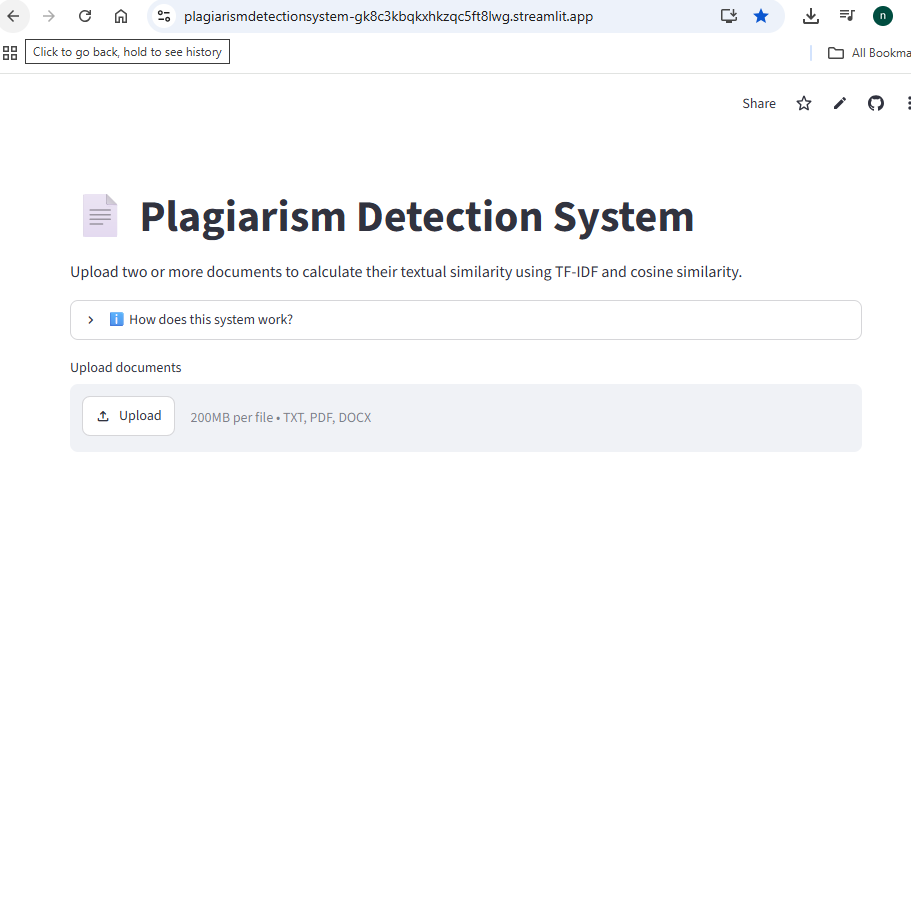
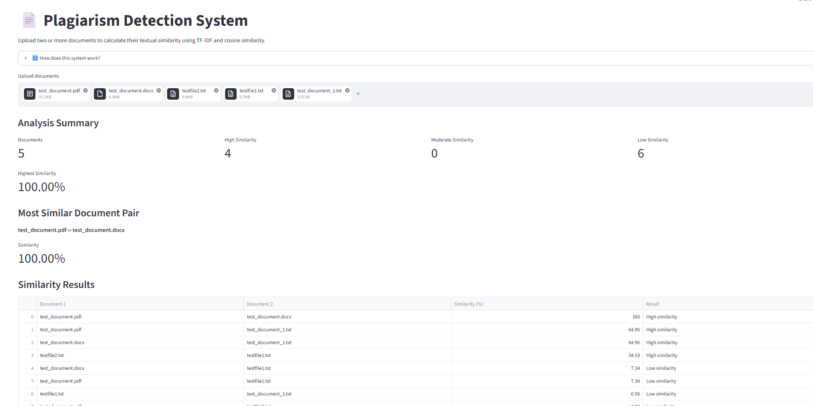
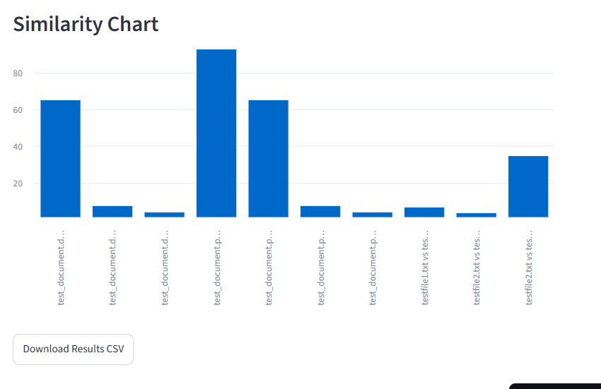

# 📄 Plagiarism Detection System

A Python-based document similarity application that compares multiple documents using **TF-IDF vectorization** and **Cosine Similarity**.

The application is built with **Streamlit** and supports TXT, PDF, and DOCX files.

## 🚀 Live Demo

[The application is deployed using Streamlit.](https://plagiarismdetectionsystem-gk8c3kbqkxhkzqc5ft8lwg.streamlit.app/)
## 📌 Project Overview

This project analyzes multiple documents and calculates the textual similarity between every pair of documents.

The system provides:

- Similarity percentage between document pairs
- Low, Moderate, and High similarity classification
- Analysis summary
- Most similar document pair
- Similarity chart
- Downloadable CSV results
- Support for TXT, PDF, and DOCX documents
- Validation for documents with no readable text

## 🧠 How It Works

### 1. Document Upload

Users can upload two or more:

- `.txt`
- `.pdf`
- `.docx`

files.

### 2. Text Extraction

Text is extracted from each uploaded document.

- TXT files are decoded directly.
- PDF files are processed using `pypdf`.
- DOCX files are processed using `python-docx`.

### 3. TF-IDF Vectorization

The extracted text is converted into numerical vectors using **TF-IDF (Term Frequency-Inverse Document Frequency)**.

### 4. Cosine Similarity

Cosine similarity is used to calculate how similar the document vectors are.

The similarity score is converted into a percentage.

### 5. Similarity Classification

The project uses the following project-specific thresholds:

| Similarity Score | Classification |
|---|---|
| Less than 15% | Low similarity |
| 15% to less than 24% | Moderate similarity |
| 24% or higher | High similarity |

These thresholds are used for this project and are not universal plagiarism standards.

## 📊 Results

The application displays:

- Total number of documents
- Number of high-similarity pairs
- Number of moderate-similarity pairs
- Number of low-similarity pairs
- Highest similarity score
- Most similar document pair
- Complete pairwise similarity results
- Similarity visualization

Users can also download the results as a CSV file.

## 📸 Screenshots

### Main Interface


### Analysis Results


### Similarity Chart


## 🛠️ Technologies Used

- Python
- Streamlit
- Pandas
- Scikit-learn
- TF-IDF
- Cosine Similarity
- PyPDF
- Python-docx

## 📁 Project Structure

```text
plagiarism_detection_system/
│
├── app.py
├── requirements.txt
└── README.md
```
## ▶️ Run Locally

Clone the repository:

```bash
git clone https://github.com/Namrahh/plagiarism_detection_system.git
```

Move into the project directory:

```bash
cd plagiarism_detection_system
```

Install the required libraries:
```bash
pip install -r requirements.txt
```

Run the Streamlit application:
```bash
streamlit run app.py
```

## ⚠️ Important Note

This application measures **textual similarity** between documents.

A high similarity score indicates substantial textual overlap, but it does not by itself prove plagiarism.

The system also works best with documents containing selectable/extractable text. Scanned image-only PDFs may require OCR before their text can be analyzed.

## 🔮 Future Improvements

Possible future improvements include:

- OCR support for scanned PDFs
- Highlighting matching text between documents
- Improved NLP preprocessing
- Semantic similarity using sentence embeddings
- Larger document collections
- More advanced plagiarism analysis

## 👩‍💻 Author

**Namra Aftab**

This project was developed as part of my portfolio while building practical skills in Python, NLP, machine learning, and data analytics.
